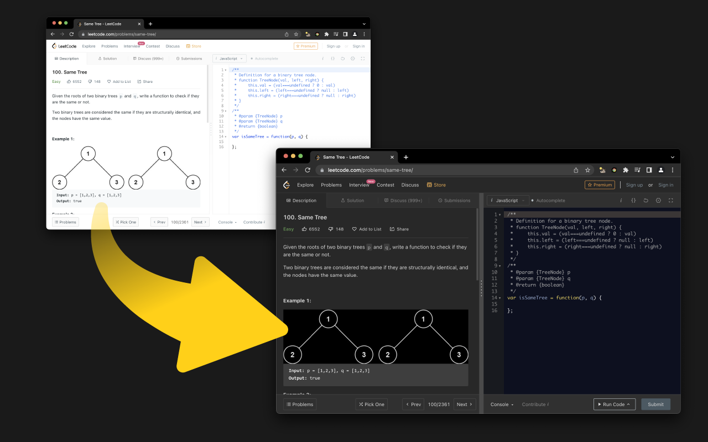
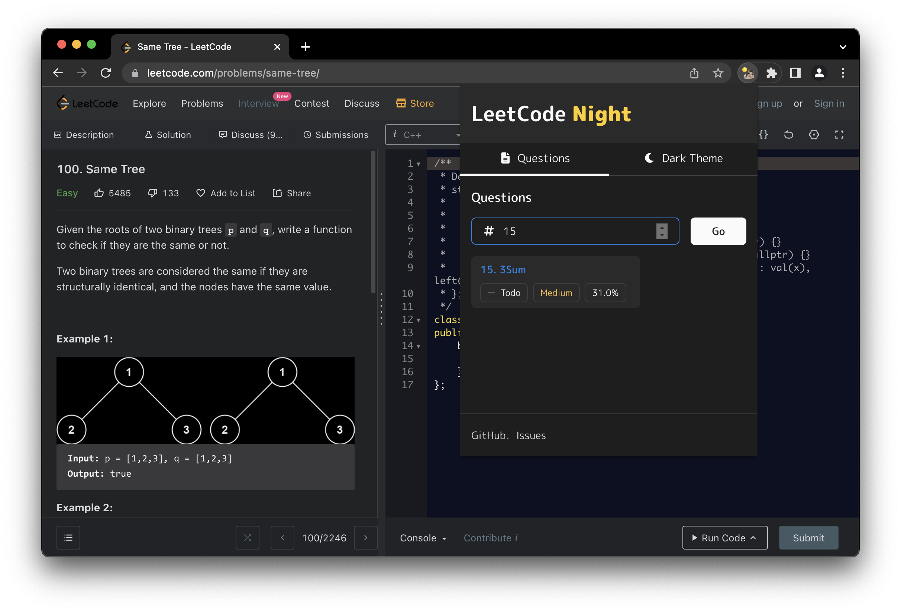
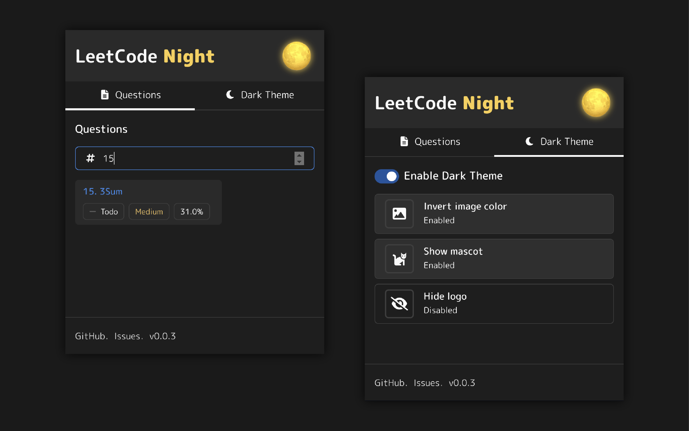

  

  A extension that enables dark mode on LeetCode.

  
  
  
  

# LeetCode Night
## Features

- Dark theme for question page
- Daily LeetCoding challenge shortcut
- Quick navigation by question number
- Reset to default code definition automatically
- Invert image color
- Hide logo

## Installation

### Download from Chrome Web Store

### Manual Download

Download latest `build.zip` from [releases](https://github.com/ngseke/leetcode-night/releases) and unzip.

  
Installation Steps

  1. Access [chrome://extensions/](chrome://extensions/)
  2. Check `Developer mode`
  3. Click on `Load unpacked extension`
  4. Select the extracted folder  for use

## Screenshot

---

## 安裝

### 從 Chrome 線上應用程式商店下載

### 手動下載

從 [releases](https://github.com/ngseke/leetcode-night/releases) 下載最新版 `build.zip` 並解壓縮。

  
安裝步驟

  1. 進入 [chrome://extensions/](chrome://extensions/)
  2. 勾選右上角的 `開發人員模式`
  3. 點擊左上角的 `載入未封裝項目`
  4. 選擇已解壓縮的 `build/` 目錄

